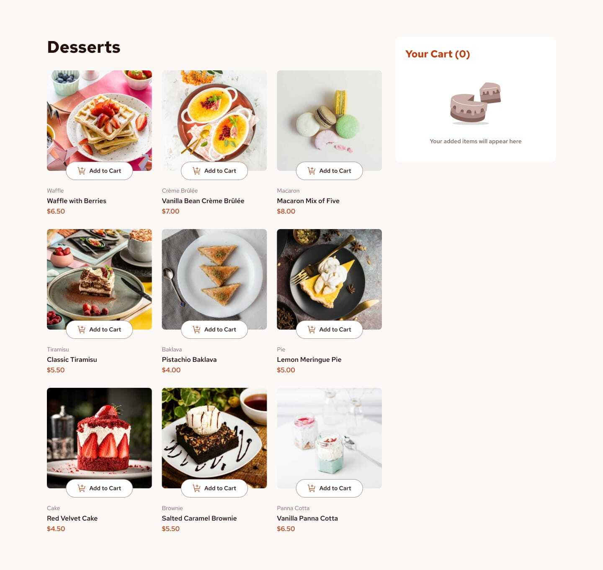
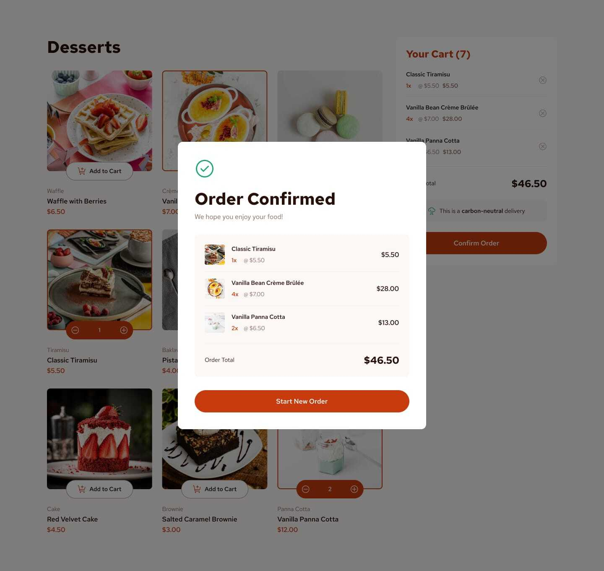

# Mini E-Commerce App

>A modern, responsive food e-commerce web application built with React, TypeScript, Vite, and Tailwind CSS.

## Features

- 🛒 Add/remove products to/from cart with quantity controls
- 🍰 Browse a variety of desserts and food items
- 💳 Dynamic cart sidebar with order total and carbon-neutral delivery
- 🔍 Responsive design for desktop and mobile
- 🧩 Modular, reusable React components
- 🌐 Routing with React Router (Home, Products, Contact)
- 🎨 Styled with Tailwind CSS for a clean, modern look

## Screenshots




## Getting Started

### Prerequisites

- Node.js (v18+ recommended)
- npm (v9+ recommended)

### Installation

<br>

1. Clone the repository:

 ```bash
 git clone https://github.com/Igna73M/Mini-E-commerce-App.git
 cd Mini-E-commerce-App
 ```

2. Install dependencies:

 ```bash
 npm install
 ```

1. Start the development server:

 ```bash
 npm run dev
 ```

1. Open [http://localhost:5173](http://localhost:5173) in your browser.

## Project Structure

```
├── public/
│   └── images/           # Product images
├── src/
│   ├── components/       # React components (Card, Products, Aside, etc.)
│   ├── LayoutFolder/     # Layout component (Header, Footer, Outlet)
│   ├── App.tsx           # Main app entry
│   └── ...
├── tailwind.config.js    # Tailwind CSS config
├── postcss.config.js     # PostCSS config
├── package.json
└── ...
```

## Main Dependencies

- [React](https://react.dev/)
- [TypeScript](https://www.typescriptlang.org/)
- [Vite](https://vitejs.dev/)
- [Tailwind CSS](https://tailwindcss.com/)
- [React Router](https://reactrouter.com/)
- [React Icons](https://react-icons.github.io/react-icons/)

## Customization

- Add or edit products in `src/components/Products.tsx`.
- Update images in `public/images/`.
- Adjust styles using Tailwind utility classes.

## License

This project is licensed under the MIT License.

---
Made with ❤️ by Igna73M
